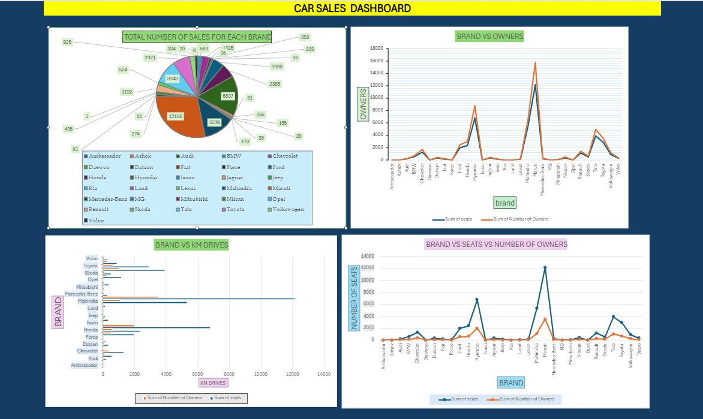

# car-sales-dashboard
This Excel sheet provides a comprehensive visualization of car sales data to help you analyze performance, trends, and patterns effectively. The sheet includes a variety of visual elements designed to present key metrics in a clear and insightful manner.
Sales Performance by Model:
Pie Chart: A pie chart breaking down the percentage of total sales for each car model, providing insight into which models are most popular.
Bar Chart: A horizontal bar chart comparing total sales figures for different car models to identify top-performing models.
Sales Trends:
Monthly Sales Trend: A line graph showing sales trends over months or quarters, helping to identify seasonal patterns and growth trends.
Year-over-Year Comparison: A multi-line graph comparing sales figures from different years to visualize growth or decline.

